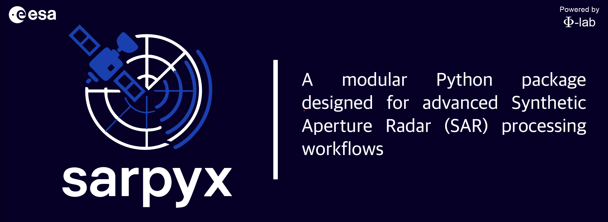

# SARPyX Documentation

Welcome to the SARPyX documentation! SARPyX is a specialized Python package for advanced Synthetic Aperture Radar (SAR) data processing, sub-aperture decomposition, and full integration with ESA's SNAP (Sentinel Application Platform) engine.

<p align="center">
    
</p>

## Table of Contents

### 📚 [User Guide](user_guide/README.md)
Complete guide for getting started with SARPyX, including installation, basic concepts, and common workflows.

### 🎯 [Tutorials](tutorials/README.md)
Step-by-step tutorials covering various SAR processing techniques and real-world applications.

### 💻 [Examples](examples/README.md)
Ready-to-run code examples demonstrating key features and processing workflows.

### 🔧 [API Reference](api/README.md)
Comprehensive API documentation for all modules, classes, and functions.

### 👩‍💻 [Developer Guide](developer_guide/README.md)
Information for developers contributing to SARPyX, including architecture, coding standards, and contribution guidelines.

### 📖 [Reference](reference/README.md)
Technical references, mathematical background, and external resources.

## Quick Start

```python
import sarpyx

# Example: Calculate vegetation indices from Sentinel-1 data
from sarpyx.science.indices import calculate_rvi, calculate_ndpoll

# Load your SAR data (VV and VH polarizations)
sigma_vv = your_vv_data  # Linear scale backscatter coefficients
sigma_vh = your_vh_data  # Linear scale backscatter coefficients

# Calculate Radar Vegetation Index
rvi = calculate_rvi(sigma_vv, sigma_vh)

# Calculate Normalized Difference Polarization Index
ndpoll = calculate_ndpoll(sigma_vv, sigma_vh)
```

## Key Features

- 🛰️ **Sub-Aperture Decomposition**: Azimuthal sub-band partitioning for enhanced resolution
- ⚙️ **SNAP Engine Integration**: Direct interface with SNAP Graph Processing Tool (GPT)
- 🗂️ **Modular Processing Pipeline**: Customizable preprocessing and analysis workflows
- 📦 **Data Compatibility**: Support for Sentinel-1, COSMO-SkyMed, and other SAR missions
- 🔌 **Extensible Architecture**: Designed for interoperability with geospatial libraries

## Installation

```bash
pip install sarpyx
```

For development installation:
```bash
git clone https://github.com/ESA-PhiLab/sarpyx.git
cd sarpyx
pip install -e .
```

## Support and Community

- 📧 **Issues**: [GitHub Issues](https://github.com/ESA-PhiLab/sarpyx/issues)
- 💬 **Discussions**: [GitHub Discussions](https://github.com/ESA-PhiLab/sarpyx/discussions)
- 📖 **Documentation**: [Full Documentation](https://sarpyx.readthedocs.io)

## License

SARPyX is released under the GPL v3 License. See the [LICENSE](../LICENSE) file for details.
